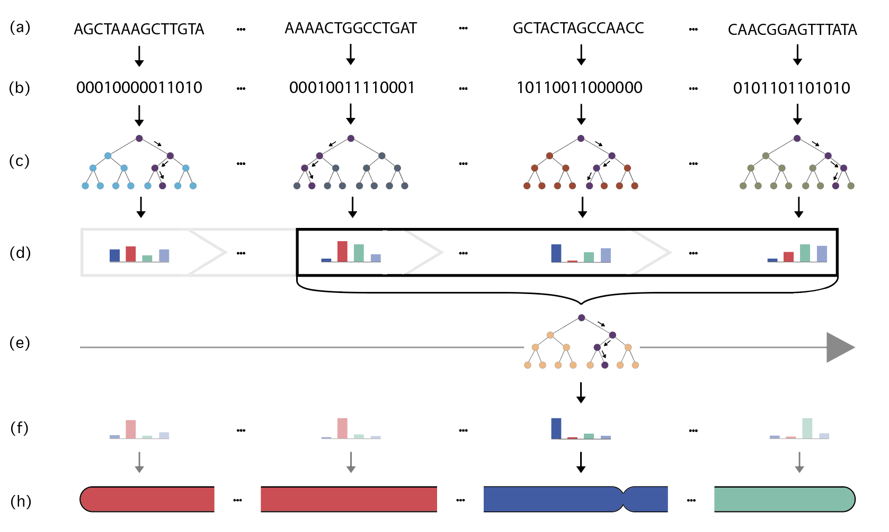
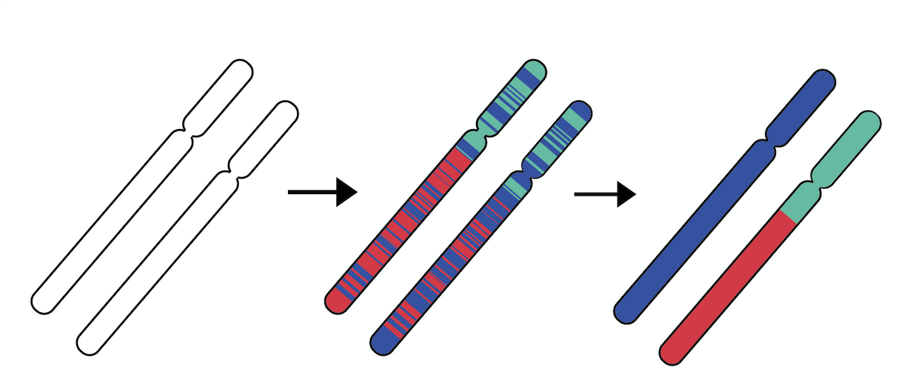

 

# High Resolution Ancestry Deconvolution for Next Generation Genomic Data 
<br>




<!--  
 -->
 
This repository includes a python implemenation of Gnomix, a fast and accurate local ancestry method.

Gnomix can be used in two ways:

- training a model from scratch using reference training data or 
- loading a pre-trained Gnomix model (see **Pre-Trained Models** below)

In both cases the models are used to infer local ancestry for provided query data.

## Dependencies
The dependencies are listed in *requirements.txt*. Assuming [pip](https://pip.pypa.io/en/stable/) is already installed, they can be installed via
```
$ pip install -r requirements.txt
```
If using the program for training a model, [BCFtools](http://samtools.github.io/bcftools/bcftools.html) must be installed and available in the PATH environment setting.

## Usage

### When Using Pre-Trained Models
gnomix.py loads and uses a pre-trained Gnomix model to predict the ancestry for a given *<query_file>* and a chromosome. 

To execute the program with a pre-trained model run:
```
$ python3 gnomix.py <query_file> <genetic_map_file> <output_basename> <chr_nr> <phase> <path_to_model> 
```

where 
- <*query_file*> is a .vcf or .vcf.gz file containing the query haplotypes which are to be analyzed (see example in the **demo/data/** folder)
- <*genetic_map_file*> is the genetic map file (see example in the **demo/data/** folder)
- <*output_basename*>.msp.tsv and <*output_basename*>.fb.tsv is where the predictions are written (see details in **Output** below and an example in the **demo/data/** folder)
- <*chr_nr*> is the chromosome number
- <*phase*> is either True or False corresponding to the intent of using the predicted ancestry for phasing (see details in **Phasing** below and in the **gnofix/** folder)
- <*path_to_model*> is a path to the model used for predictions (see **Pre-trained Models** below)

### When Training a Model From Scratch

To execute the program when training a model run:
```
$ python3 gnomix.py <query_file> <genetic_map_file> <output_basename> <chr_nr> <phase> <reference_file> <sample_map_file>
```

where the first 5 arguments are described above in the pre-trained setting and 
- <*reference_file*> is a .vcf or .vcf.gz file containing the reference haplotypes (in any order)
- <*sample_map_file*> is a sample map file matching reference samples to their respective reference populations

The program uses these two files as input to our simulation algorithm (see **pyadmix/**) to create training data for the model.

### Advanced Options
More advanced configuration settings can be found in *config.yaml*. 
They include general settings, simulation settings and model settings. More details are given in the file itself. This can only be used if training a model from scratch. Simply pass the config file's path as the last argument. 
```
$ python3 gnomix.py <query_file> <genetic_map_file> <output_basename> <chr_nr> <phase> <reference_file> <sample_map_file> <config_file>
```
If no config is given, the program uses the default. The config file has advanced training options. Some of the parameters are
- verbose (bool) - verbosity
- simulation:
  - run: (bool) - whether to run simulation or not
  - path: (path) - if run is False, use data from this location. Must have been created by gnomix in the past.
  - rm_data (bool) - whether to remove simulated data (if memory constrained). It is set to false if run is False
  - r_admixed (float,positive) - number of simulated individuals generated = r_admixed x Size of sample map
  - splits: must contain train1, train2 and optionally val. If val ratio is 0, val is  ignored. generations indicates simulated individuals' generations. train1, train2 have 0 by default and val cannot have 0
- model:
  - name (string) - model's name: default is "model"
  - inference (string) - 3 possible options - best / fast / default. "best" uses random string kernel base + xgboost smoother. "fast" uses logistic regression base + crf smoother. "default" uses logistic regression base + xgboost smoother
  - window_size_cM (float, positive) -  size of window in centiMorgans
  - smooth_size (int, positive) - number of windows to be taken as context for smoother
  - context_ratio (float between 0 and 1) - context of base model windows
  - retrain_base (bool) - retrain base models with train2, val data for a grand final base model
  - calibrate (bool) - if True, applies calibration on output probabilities
  - n_cores (int, positive) - how many units of cpu to use

#### Calibration
To ensure that gnomix outputs probability estimates that reflect it's true confidence and accuracy, we recommend using calibration. We use Isotonic Regression to map the predicted probabilities to calibrated probabilities where the latter is more likely to have predictions with confidence X% correct X% of the time.

## Output

### *<output_basename>*.msp.tsv
The first line is a comment line, that specifies the order and encoding of populations, eg:
#Sub_population order/code: golden_retriever=0 labrador_retriever=1 poodle poodle_small=2

The second line specifies the column names, and every following line marks a genome position.

The first 6 columns specify
- the chromosome
- interval of genetic marker's physical position in basepair units (one column represents the starting point and one the end point)
- interval of genetic position in centiMorgans (one column represents the starting point and one the end point)
- number of *<query_file>* SNP positions that are included in interval

The remaining columns give the predicted reference panel population for the given interval. A genotype has two haplotypes, so the number of predictions for a genotype is 2*(number of genotypes) and therefore the total number of columns in the file is 6 + 2*(number of genotypes)

### *<output_basename>*.fb.tsv
The first line is a comment line, that specifies the order of the populations, eg:
#reference_panel_population:	AFR	EUR	NAT

The second line specifies the column names, and every following line marks a genome position.

The first 4 columns specify
- the chromosome
- mean of genetic marker's physical position in basepair units
- mean of genetic position in centiMorgans
- genetic marker index

The remaining columns represent the query hapotypes and reference panel population and each line markes the estimated probability of the given genome position coming from the population. A genotype has two haplotypes, so the number of predictions for a genotype is 2*(number of genotypes)*(number of reference populations) and therefore the total number of columns in the file is 6 + 2*(number of genotypes)*(number of reference populations).

### Model and simulated data
When training a model, the resulting model will be stored in **./models**. That way it can be re-used for analyzing another dataset.
The model's estimated accuracy is logged along with a confusion matrix which is stored in **./models/analysis**.
The program simulates training data and stores in **./generated_data**. To automatically remove the created data when training is done,
set *rm_simulated_data* to True in *config.py*. Note that in some cases, the simulated data can be re-used for training with similar settings. 
In those cases, not removing the data and then setting *run_simulation* to False will re-use the previously simulated data which can save a lot of time and compuation.

## Pre-Trained Models

Pre-trained models will soon be made available for download.

When making predictions, the input to the model is an intersection of the pre-trained model SNP positions and the SNP positions from the <query_file>. That means that the set of positions that's only in the original training input (and not in the query samples) is encoded as missing, while the set of positions only in the <query_file> is discarded. When the script is executed, it will log the intersection-ratio as the performance will depend on how much of the original positions are missing. When the intersection is low, we recommend using a model trained with high percentage of missing data, or imputing the query samples to have all SNPs present in the pre-trained model.

The models are trained on hg build 37 references from the following biogeographic regions: *Subsaharan African (AFR), East Asian (EAS), European (EUR), Native American (NAT), Oceanian (OCE), South Asian (SAS), and West Asian (WAS)* and labels and predicts them as 0, 1, .., 6 respectively. The populations used to train these ancestries are given in the supplementary section of the reference provided at the bottom of this readme.

## Phasing


Accurate phasing of genomic data is crucial for human demographic modeling and identity-by-descent analyses. It has been shown that leveraging information about an individual’s genomic ancestry improves performance of current phasing algorithms. Gnofix is a method that uses local ancestry inference to do exactly that. If you suspect your data might be badly phased (often the case when reference panel is small and/or diverse), we recommend using this option. See the **gnofix/** folder for more details. 


Sequenced haplotypes phased with a phasing software (left). LAI is used to label haplotypes with ancestry predictions and phasing errors become evident (center). Phasing error correction using LAI is applied to correct phasing errors (right).

## License

**NOTICE**: This software is available for use free of charge for academic research use only. Commercial users, for profit companies or consultants, and non-profit institutions not qualifying as "academic research" must contact the [Stanford Office of Technology Licensing](https://otl.stanford.edu/) for a separate license. This applies to this repository directly and any other repository that includes source, executables, or git commands that pull/clone this repository as part of its function. Such repositories, whether ours or others, must include this notice. Academic users may fork this repository and modify and improve to suit their research needs, but also inherit these terms and must include a licensing notice to this effect.

## Cite

#### When using this software, please cite: Kumar, A., Montserrat, D.M., Bustamante, C. and Ioannidis, A., "XGMix: Local-Ancestry Inference With Stacked XGBoost," International Conference on Learning Representations Workshops (ICLR, 2020, Workshop AI4AH).

https://www.biorxiv.org/content/10.1101/2020.04.21.053876v1

```
@article{kumar2020xgmix,
  title={XGMix: Local-Ancestry Inference With Stacked XGBoost},
  author={Kumar, Arvind and Montserrat, Daniel Mas and Bustamante, Carlos and Ioannidis, Alexander},
  journal={International Conference of Learning Representations Workshops, AI4AH},
  year={2020}
}
```

#### You can also include its companion paper: Montserrat, D.M., Kumar, A., Bustamante, C. and Ioannidis, A., "Addressing Ancestry Disparities in Genomic Medicine: A Geographic-aware Algorithm," International Conference on Learning Representations Workshops (ICLR, 2020, Workshop AI4CC).

https://arxiv.org/pdf/2004.12053.pdf

```
@article{montserrat2020addressing,
  title={Addressing Ancestry Disparities in Genomic Medicine: A Geographic-aware Algorithm},
  author={Montserrat, Daniel Mas and Kumar, Arvind and Bustamante, Carlos and Ioannidis, Alexander},
  journal={International Conference of Learning Representations Workshops, AI4CC},
  year={2020}
}
```


