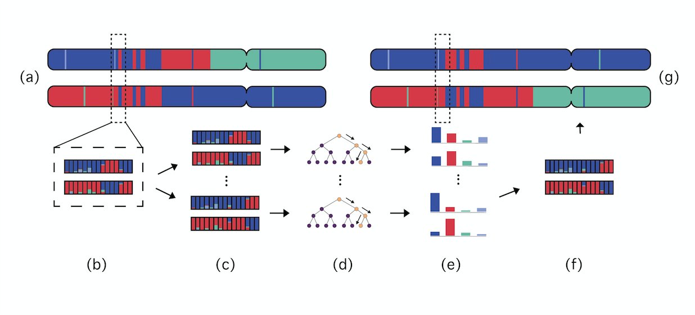

# Gnofix 


## Motivation

Accurate phasing of genomic data is crucial for human demographic modeling and identity-by-descent analyses. It has been shown that leveraging information about an individual’s genomic ancestry improves performance of current phasing algorithms. Gnofix is a method that uses local ancestry inference (LAI) to do exactly that.


Sequenced haplotypes phased with a phasing software (left). LAI used to label haplotypes with ancestry predictions and phasing errors become evident (center). Phasing error correction using LAI is applied to correct phasing errors (right).

## Method

Gnofix uses a trained smoother from G-Nomix to estimate the probability of a given sequence being from the distribution of a human haplotype (correctly phased) and leverages those estimates to iteratively switch parts along the haplotypes to ultimately find the most probable one. 


- (a) Maternal and paternal haplotypes at a given iteration and a given step of Gnofix. Dashed box marks the scope. 
- (b) Ancestry probabilities at windows in scope are extracted.
- (c) Windows in scope are permuted (to form possible fixes).
- (d)-(e) Permutations are passed through the smoother to obtain predictions and their confidence.
- (f) Permutation with highest confidence is chosen.
- (g) Windows in scope are returned to the haplotypes, preserving the scope’s right boundary (i.e. if rightmost window switched between haplotypes, entire 
right part switches too), before moving the scope one window to the right for next step.

## Result

Below is a visualization of the process for one - in this case the first - iteration of the algorithm applied on real data. The two haplotypes are from a simulated Latino individual with the red color corresponding to African segment, blue to the European segment and green to the indigenous American segment.


Gnofix starts off with the maternal and paternal haplotypes phased from Beagle, a standard phasing softwere. The ancestry is inferred by Gnomix and phasing errors become evident as ancestries switch haplotypes at exactly the same position repeatedly. At each step Gnofix performs the procedure described above. Once the complete iteration is over, one can see how the ancestry predictions are almost uniform and resemble a chromosome pair with contiguous segments inherited from the 3 different ancestries, rather than ancestries switching simultaneously, and in concert, at the same position on both haplotypes, which is highly unlikely to occur outside of phasing errors.

## Cite

#### When using this software, please cite: 
### Helgi Hilmarsson, Arvind S Kumar, Richa Rastogi, Carlos D Bustamante, Daniel Mas Montserrat, Alexander G Ioannidis: "High Resolution Ancestry Deconvolution for Next Generation Genomic Data"

https://www.biorxiv.org/content/10.1101/2021.09.19.460980v1

```
@article {Hilmarsson2021.09.19.460980,
	author = {Hilmarsson, Helgi and Kumar, Arvind S and Rastogi, Richa and Bustamante, Carlos D and Mas Montserrat, Daniel and Ioannidis, Alexander G},
	title = {High Resolution Ancestry Deconvolution for Next Generation Genomic Data},
	elocation-id = {2021.09.19.460980},
	year = {2021},
	doi = {10.1101/2021.09.19.460980},
	publisher = {Cold Spring Harbor Laboratory},
	abstract = {As genome-wide association studies and genetic risk prediction models are extended to globally diverse and admixed cohorts, ancestry deconvolution has become an increasingly important tool. Also known as local ancestry inference (LAI), this technique identifies the ancestry of each region of an individual{\textquoteright}s genome, thus permitting downstream analyses to account for genetic effects that vary between ancestries. Since existing LAI methods were developed before the rise of massive, whole genome biobanks, they are computationally burdened by these large next generation datasets. Current LAI algorithms also fail to harness the potential of whole genome sequences, falling well short of the accuracy that such high variant densities can enable. Here we introduce Gnomix, a set of algorithms that address each of these points, achieving higher accuracy and swifter computational performance than any existing LAI method, while also enabling portable models that are particularly useful when training data are not shareable due to privacy or other restrictions. We demonstrate Gnomix (and its swift phase correction counterpart Gnofix) on worldwide whole-genome data from both humans and canids and utilize its high resolution accuracy to identify the location of ancient New World haplotypes in the Xoloitzcuintle, dating back over 100 generations. Code is available at https://github.com/AI-sandbox/gnomixCompeting Interest StatementCDB is the founder and CEO of Galatea Bio Inc and on the boards of Genomics PLC and Etalon.},
	URL = {https://www.biorxiv.org/content/early/2021/09/21/2021.09.19.460980},
	eprint = {https://www.biorxiv.org/content/early/2021/09/21/2021.09.19.460980.full.pdf},
	journal = {bioRxiv}
}
